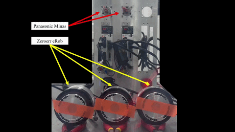

# Motor Manager

<p align="left">
  
</p>

## English Version

`motor_manager` is a C++ library for integrated motor control across different communication systems and motor drivers.

### Clone

```bash
mkdir -p ~/colcon_ws/src
cd ~/colcon_ws

git clone https://github.com/SeonilChoi/motor_manager.git src
```

### Build

```bash
cd ~/colcon_ws

rosdep install --from-paths src --ignore-src -r -y
colcon build --packages-up-to motor_manager
source install/setup.bash
```

### Configuration

#### YAML Example

The configuration file for `master`, `controller`, and `driver` can be written as follows.

```yaml
period: 1000000
masters:
  - id: 0
    type: ethercat
    number_of_slaves: 1
    ethercat_master_index: 0
    slaves:
      - controller_index: 0
        driver_id: 0
        alias: 0
        position: 0
        vendor_id: 0x5a65726f
        product_id: 0x00029252
        profile_mode: 0 # 0: Position Mode, 1: Velocity Mode, 2: Effort Mode

drivers:
  - id: 0
    pulse_per_revolution: 524288
    rated_effort: 52.0
    unit_effort: 0.1
    lower: -57.2957795131
    upper: 57.2957795131
    speed: 3000
    acceleration: 143.2394487827
    deceleration: 143.2394487827
    profile_velocity: 143.2394487827
    profile_acceleration: 143.2394487827
    profile_deceleration: 143.2394487827
    profile_position_value: 1
    profile_velocity_value: 3
    profile_effort_value: 4
    type: zeroerr
    param_file: ../param
```

`profile_mode` follows the values below.

| Value | Mode |
| --- | --- |
| `0` | Profile position |
| `1` | Profile velocity |
| `2` | Profile effort |

The parameter file for `driver` hardware configuration can be written as follows.

```yaml
items:
  - { id: 30, index: 0x6060, subindex: 0x00, value: 1,       type: s8  } # Modes of operation
  - { id: 31, index: 0x3511, subindex: 0x00, value: 100,     type: s16 } # Effort setup for emergency stop
  - { id: 32, index: 0x3512, subindex: 0x00, value: 50,      type: s16 } # Over-load level setup
  - { id: 33, index: 0x3513, subindex: 0x00, value: 120,     type: s16 } # Over-speed level setup
  - { id: 34, index: 0x3514, subindex: 0x00, value: 1,       type: s16 } # Motor working range setup
  - { id: 35, index: 0x607F, subindex: 0x00, value: 2000000, type: u32 } # Max profile velocity
  - { id: 36, index: 0x6082, subindex: 0x00, value: 500,     type: u32 } # End velocity
  - { id: 37, index: 0x60B1, subindex: 0x00, value: 0,       type: s32 } # Velocity offset
  - { id: 38, index: 0x60B2, subindex: 0x00, value: 0,       type: s16 } # Effort offset
  - { id: 50, index: 0x6072, subindex: 0x00, value: 0,       type: u16 } # Max effort
  - { id: 51, index: 0x607B, subindex: 0x01, value: 0,       type: s32 } # Min position range limit
  - { id: 52, index: 0x607B, subindex: 0x02, value: 0,       type: s32 } # Max position range limit
  - { id: 51, index: 0x607D, subindex: 0x01, value: 0,       type: s32 } # Min software position limit
  - { id: 52, index: 0x607D, subindex: 0x02, value: 0,       type: s32 } # Max software position limit
  - { id: 53, index: 0x6080, subindex: 0x00, value: 0,       type: u32 } # Max motor speed
  - { id: 54, index: 0x6081, subindex: 0x00, value: 0,       type: u32 } # Profile velocity
  - { id: 55, index: 0x6083, subindex: 0x00, value: 0,       type: u32 } # Profile acceleration
  - { id: 56, index: 0x6084, subindex: 0x00, value: 0,       type: u32 } # Profile deceleration
  - { id: 57, index: 0x60C5, subindex: 0x00, value: 0,       type: u32 } # Max acceleration
  - { id: 58, index: 0x60C6, subindex: 0x00, value: 0,       type: u32 } # Max deceleration

interfaces:
  - { id: 98, index: 0x1600                                     } # RxPDO
  - { id: 0,  index: 0x6040, subindex: 0x00, size: 2, type: u16 } # Control word
  - { id: 1,  index: 0x607A, subindex: 0x00, size: 4, type: s32 } # Target position
  - { id: 2,  index: 0x60FF, subindex: 0x00, size: 4, type: s32 } # Target velocity
  - { id: 3,  index: 0x6071, subindex: 0x00, size: 2, type: s16 } # Target effort
  - { id: 99, index: 0x1A00                                     } # TxPDO
  - { id: 4,  index: 0x6041, subindex: 0x00, size: 2, type: u16 } # Status word
  - { id: 5,  index: 0x603F, subindex: 0x00, size: 2, type: u16 } # Error code
  - { id: 6,  index: 0x6064, subindex: 0x00, size: 4, type: s32 } # Position actual value
  - { id: 7,  index: 0x606C, subindex: 0x00, size: 4, type: s32 } # Velocity actual value
  - { id: 8,  index: 0x6077, subindex: 0x00, size: 2, type: s16 } # Effort actual value
```

### Available Systems

#### Communication

| Type | Status |
| --- | --- |
| `EtherCAT` | :white_check_mark: |
| `CANopen` | :white_check_mark: |
| `SocketCAN` | :white_check_mark: |
| `Serial` | :white_check_mark: |

#### Hardware

| Type | Status |
| --- | --- |
| `Minas` | :white_check_mark: |
| `ZeroErr` | :white_check_mark: |
| `Dynamixel` | :white_check_mark: |
| `CubeMars` | :white_check_mark: |

## Korean Version

`motor_manager`는 이기종 간 통합 모터 제어를 위한 C++ 라이브러리이다.

### Clone

```bash
mkdir -p ~/colcon_ws/src
cd ~/colcon_ws

git clone https://github.com/SeonilChoi/motor_manager.git src
```

### Build

```bash
cd ~/colcon_ws

rosdep install --from-paths src --ignore-src -r -y
colcon build --packages-up-to motor_manager
source install/setup.bash
```

### Configuration

#### YAML Example

`master`, `controller`, 그리고 `driver`를 위한 설정 파일은 아래와 같이 작성한다.

```yaml
period: 1000000
masters:
  - id: 0
    type: ethercat
    number_of_slaves: 1
    ethercat_master_index: 0
    slaves:
      - controller_index: 0
        driver_id: 0
        alias: 0
        position: 0
        vendor_id: 0x5a65726f
        product_id: 0x00029252
        profile_mode: 0 # 0: Position Mode, 1: Velocity Mode, 2: Effort Mode

drivers:
  - id: 0
    pulse_per_revolution: 524288
    rated_effort: 52.0
    unit_effort: 0.1
    lower: -57.2957795131
    upper: 57.2957795131
    speed: 3000
    acceleration: 143.2394487827
    deceleration: 143.2394487827
    profile_velocity: 143.2394487827
    profile_acceleration: 143.2394487827
    profile_deceleration: 143.2394487827
    profile_position_value: 1
    profile_velocity_value: 3
    profile_effort_value: 4
    type: zeroerr
    param_file: ../param
```

`profile_mode`는 아래의 설정을 따른다.

| Value | Mode |
| --- | --- |
| `0` | Profile position |
| `1` | Profile velocity |
| `2` | Profile effort |

`driver`의 하드웨어 설정을 위한 파라미터 파일은 아래와 같이 작성한다.

```yaml
items:
  - { id: 30, index: 0x6060, subindex: 0x00, value: 1,       type: s8  } # Modes of operation
  - { id: 31, index: 0x3511, subindex: 0x00, value: 100,     type: s16 } # Effort setup for emergency stop
  - { id: 32, index: 0x3512, subindex: 0x00, value: 50,      type: s16 } # Over-load level setup
  - { id: 33, index: 0x3513, subindex: 0x00, value: 120,     type: s16 } # Over-speed level setup
  - { id: 34, index: 0x3514, subindex: 0x00, value: 1,       type: s16 } # Motor working range setup
  - { id: 35, index: 0x607F, subindex: 0x00, value: 2000000, type: u32 } # Max profile velocity
  - { id: 36, index: 0x6082, subindex: 0x00, value: 500,     type: u32 } # End velocity
  - { id: 37, index: 0x60B1, subindex: 0x00, value: 0,       type: s32 } # Velocity offset
  - { id: 38, index: 0x60B2, subindex: 0x00, value: 0,       type: s16 } # Effort offset
  - { id: 50, index: 0x6072, subindex: 0x00, value: 0,       type: u16 } # Max effort
  - { id: 51, index: 0x607B, subindex: 0x01, value: 0,       type: s32 } # Min position range limit
  - { id: 52, index: 0x607B, subindex: 0x02, value: 0,       type: s32 } # Max position range limit
  - { id: 51, index: 0x607D, subindex: 0x01, value: 0,       type: s32 } # Min software position limit
  - { id: 52, index: 0x607D, subindex: 0x02, value: 0,       type: s32 } # Max software position limit
  - { id: 53, index: 0x6080, subindex: 0x00, value: 0,       type: u32 } # Max motor speed
  - { id: 54, index: 0x6081, subindex: 0x00, value: 0,       type: u32 } # Profile velocity
  - { id: 55, index: 0x6083, subindex: 0x00, value: 0,       type: u32 } # Profile acceleration
  - { id: 56, index: 0x6084, subindex: 0x00, value: 0,       type: u32 } # Profile deceleration
  - { id: 57, index: 0x60C5, subindex: 0x00, value: 0,       type: u32 } # Max acceleration
  - { id: 58, index: 0x60C6, subindex: 0x00, value: 0,       type: u32 } # Max deceleration

interfaces:
  - { id: 98, index: 0x1600                                     } # RxPDO
  - { id: 0,  index: 0x6040, subindex: 0x00, size: 2, type: u16 } # Control word
  - { id: 1,  index: 0x607A, subindex: 0x00, size: 4, type: s32 } # Target position
  - { id: 2,  index: 0x60FF, subindex: 0x00, size: 4, type: s32 } # Target velocity
  - { id: 3,  index: 0x6071, subindex: 0x00, size: 2, type: s16 } # Target effort
  - { id: 99, index: 0x1A00                                     } # TxPDO
  - { id: 4,  index: 0x6041, subindex: 0x00, size: 2, type: u16 } # Status word
  - { id: 5,  index: 0x603F, subindex: 0x00, size: 2, type: u16 } # Error code
  - { id: 6,  index: 0x6064, subindex: 0x00, size: 4, type: s32 } # Position actual value
  - { id: 7,  index: 0x606C, subindex: 0x00, size: 4, type: s32 } # Velocity actual value
  - { id: 8,  index: 0x6077, subindex: 0x00, size: 2, type: s16 } # Effort actual value
```

### Available Systems

#### Communication

| Type | Status |
| --- | --- |
| `EtherCAT` | :white_check_mark: |
| `CANopen` | :white_check_mark: |
| `SocketCAN` | :white_check_mark: |
| `Serial` | :white_check_mark: |

#### Hardware

| Type | Status |
| --- | --- |
| `Minas` | :white_check_mark: |
| `ZeroErr` | :white_check_mark: |
| `Dynamixel` | :white_check_mark: |
| `CubeMars` | :white_check_mark: |
