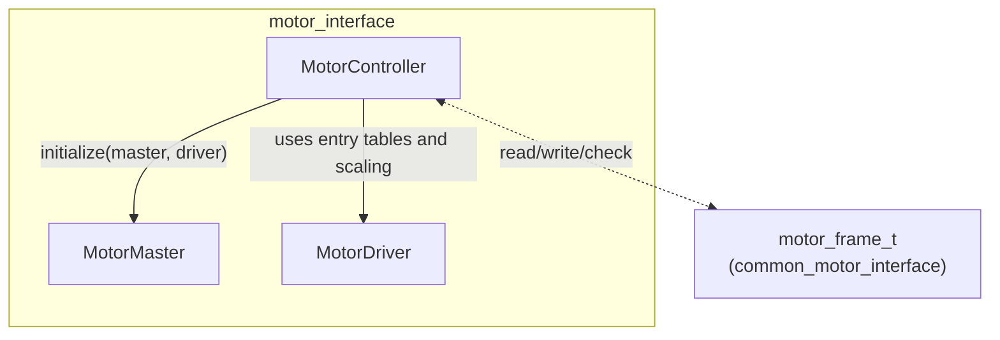

# motor_interface

Abstract C++ interfaces used by the `motor_manager` package. The headers are installed from `include/motor_interface` and all symbols live in namespace `motor_interface`.

This library does not talk to hardware directly. Concrete transports implement `MotorMaster` and `MotorController`; concrete vendors implement `MotorDriver`.

## Class roles

## Limits

| Constant | Value | Meaning |
| --- | --- | --- |
| `MAX_MASTER_SIZE` | `8` | Maximum configured masters. |
| `MAX_DRIVER_SIZE` | `8` | Maximum configured drivers. |
| `MAX_CONTROLLER_SIZE` | `16` | Maximum configured controllers. |
| `MAX_DATA_SIZE` | `4` | Maximum bytes stored in `entry_table_t::data`. |
| `MAX_ITEM_SIZE` | `32` | Maximum SDO/config items per driver. |

## `MotorMaster`

Declared in `include/motor_interface/motor_master.hpp`.

`MotorMaster` represents one fieldbus master. EtherCAT and CANopen implementations derive from it.

### `master_config_t`

| Field | Type | Used by | Meaning |
| --- | --- | --- | --- |
| `id` | `uint8_t` | all | Master ID from `masters[].id`. |
| `number_of_slaves` | `uint8_t` | all | Number of slave/controller entries under the master. |
| `ethercat_master_index` | `unsigned int` | EtherCAT | IgH master index passed to `ecrt_request_master`. |
| `can_interface_index` | `unsigned int` | CANopen | SocketCAN suffix; `0` binds to `can0`. |
| `can_bitrate` | `unsigned int` | CANopen | Config value retained by the master. Interface bitrate must still be set before launch. |

### Virtual functions

| Function | Meaning |
| --- | --- |
| `initialize()` | Open/configure the master resource. |
| `activate()` | Start communication. |
| `deactivate()` | Stop communication and release resources. |
| `transmit()` | Send pending bus data. |
| `receive()` | Receive/process bus data. |
| `apply_application_time(time)` | Apply cycle timestamp when the bus supports it. |
| `save_clock()` | Synchronize/save bus clocks when supported. |

## `MotorController`

Declared in `include/motor_interface/motor_controller.hpp`.

`MotorController` maps one configured slave/node to one `MotorMaster` and one `MotorDriver`.

### `slave_config_t`

| Field | Type | Used by | Meaning |
| --- | --- | --- | --- |
| `controller_index` | `uint8_t` | all | Dense index in `MotorManager::controllers_`. |
| `master_id` | `uint8_t` | all | Owning master ID. |
| `driver_id` | `uint8_t` | all | Driver ID used for PDO layout and scaling. |
| `alias` | `uint16_t` | EtherCAT | EtherCAT alias. |
| `position` | `uint16_t` | EtherCAT | EtherCAT ring position. |
| `node_id` | `uint8_t` | CANopen | CANopen node ID. |
| `vendor_id` | `uint32_t` | EtherCAT | EtherCAT vendor ID. |
| `product_id` | `uint32_t` | EtherCAT | EtherCAT product code. |
| `profile_mode` | `int8_t` | all controllers | `0`: position, `1`: velocity, `2`: torque. |

The concrete controller implements `enable`, `disable`, `check`, `write`, and `read` over `motor_frame_t`.

## `MotorDriver`

Declared in `include/motor_interface/motor_driver.hpp`.

`MotorDriver` owns vendor-specific SDO items, PDO interface definitions, CiA402 enable/disable transitions, and unit conversion between raw drive values and physical values.

### `driver_config_t`

| Field | Type | Meaning |
| --- | --- | --- |
| `id` | `uint8_t` | Driver ID from `drivers[].id`. |
| `pulse_per_revolution` | `uint32_t` | Encoder scale for position/velocity conversion. |
| `rated_torque` | `double` | Rated torque used by torque conversion. |
| `unit_torque` | `double` | Raw torque unit scale. |
| `lower` / `upper` | `double` | Software position limits. |
| `speed` | `double` | Maximum speed parameter. |
| `acceleration` / `deceleration` | `double` | Maximum acceleration/deceleration parameters. |
| `profile_velocity` | `double` | Profile velocity parameter. |
| `profile_acceleration` | `double` | Profile acceleration parameter. |
| `profile_deceleration` | `double` | Profile deceleration parameter. |
| `profile_position_value` | `int8_t` | Operation-mode value for profile position mode. |
| `profile_velocity_value` | `int8_t` | Operation-mode value for profile velocity mode. |
| `profile_torque_value` | `int8_t` | Operation-mode value for profile torque mode. |

### `entry_table_t`

| Field | Type | Meaning |
| --- | --- | --- |
| `id` | `uint8_t` | Semantic interface/config ID. |
| `index` | `uint16_t` | CANopen object dictionary index. |
| `subindex` | `uint8_t` | CANopen object dictionary subindex. |
| `type` | `DataType` | Raw data type. |
| `size` | `uint8_t` | Payload size in bytes. |
| `data` | `uint8_t[MAX_DATA_SIZE]` | Little-endian payload buffer. |

### Enums

`DataType`: `U8`, `U16`, `U32`, `U64`, `S8`, `S16`, `S32`

`DriverState`: `Fault`, `SwitchOnDisabled`, `ReadyToSwitchOn`, `SwitchedOn`, `OperationEnabled`

### Helper functions

| Function | Purpose |
| --- | --- |
| `DataType toDataType(const std::string& type)` | Parses YAML strings such as `u16` or `s32`. |
| `template <typename T> T value(const uint8_t* data)` | Decodes a little-endian byte buffer. |
| `template <typename T> void fill(const T& value, uint8_t* data)` | Encodes a value into a little-endian byte buffer. |

## Semantic IDs

These IDs are used by driver YAML files and `motor_frame_t::target_interface_id`.

| Constant | Value | Meaning |
| --- | --- | --- |
| `ID_CONTROLWORD` | `0` | Command controlword. |
| `ID_TARGET_POSITION` | `1` | Target position. |
| `ID_TARGET_VELOCITY` | `2` | Target velocity. |
| `ID_TARGET_TORQUE` | `3` | Target torque. |
| `ID_STATUSWORD` | `4` | Statusword. |
| `ID_ERRORCODE` | `5` | Error code. |
| `ID_CURRENT_POSITION` | `6` | Actual position. |
| `ID_CURRENT_VELOCITY` | `7` | Actual velocity. |
| `ID_CURRENT_TORQUE` | `8` | Actual torque. |
| `ID_OPERATING_MODE` | `30` | Operation mode object. |
| `ID_MAX_TORQUE` | `50` | Max torque parameter. |
| `ID_MIN_POSITION_LIMIT` | `51` | Minimum software position limit. |
| `ID_MAX_POSITION_LIMIT` | `52` | Maximum software position limit. |
| `ID_MAX_MOTOR_SPEED` | `53` | Maximum motor speed. |
| `ID_PROFILE_VELOCITY` | `54` | Profile velocity. |
| `ID_PROFILE_ACCELERATION` | `55` | Profile acceleration. |
| `ID_PROFILE_DECELERATION` | `56` | Profile deceleration. |
| `ID_MAX_ACCELERATION` | `57` | Maximum acceleration. |
| `ID_MAX_DECELERATION` | `58` | Maximum deceleration. |
| `ID_RXPDO` | `98` | RX PDO marker row in driver interface YAML. |
| `ID_TXPDO` | `99` | TX PDO marker row in driver interface YAML. |
