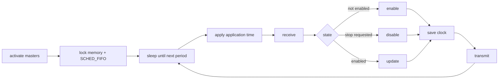
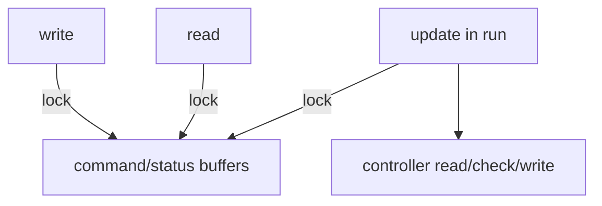

# motor_manager library

`motor_manager::MotorManager` is the runtime library that loads a motor YAML file, constructs masters/drivers/controllers, and runs the cyclic bus loop.

Header: `include/motor_manager/motor_manager.hpp`

## Construction

```cpp
#include "motor_manager/motor_manager.hpp"

motor_manager::MotorManager manager("/path/to/config.yaml");
manager.run();
```

The constructor loads the YAML configuration and initializes all masters and controllers. `run()` activates the masters and blocks until `request_stop()` finishes disabling all axes or `request_exit()` clears the loop flag.

## Public API

| Function | Description |
| --- | --- |
| `MotorManager(config_file)` | Loads YAML, creates EtherCAT/CANopen masters, creates MINAS/ZeroErr drivers, loads driver parameter YAML, and initializes controllers. |
| `run()` | Starts the periodic loop. Requires permission for `mlockall` and `SCHED_FIFO`. |
| `write(command, size)` | Copies command frames into the manager and marks the command buffer changed. |
| `read(status)` | Copies the latest status frames out of the manager. |
| `request_stop()` | Requests drive disable; the loop returns after all controllers report disabled. |
| `request_exit()` | Stops the loop without waiting for drive disable. |
| `period()` | Returns the configured period in nanoseconds. |
| `number_of_controllers()` | Returns the number of configured slave/controller entries. |

## Loop flow



`update()` reads every controller, runs each controller's set-point check, stops command output if any status frame has a nonzero `errorcode`, and writes new commands only when `write()` has marked the command buffer changed.

## Configuration schema

Top-level keys:

| Key | Meaning |
| --- | --- |
| `period` | Cycle period in nanoseconds. |
| `masters` | List of fieldbus masters and their slaves/nodes. |
| `drivers` | List of vendor driver configs. |

### EtherCAT master

```yaml
masters:
  - id: 0
    type: ethercat
    number_of_slaves: 1
    ethercat_master_index: 0
    slaves:
      - controller_index: 0
        driver_id: 0
        alias: 0
        position: 0
        vendor_id: 0x5a65726f
        product_id: 0x00029252
        profile_mode: 0
```

### CANopen master

```yaml
masters:
  - id: 0
    type: canopen
    number_of_slaves: 1
    can_interface_index: 0
    can_bitrate: 1000000
    slaves:
      - controller_index: 0
        driver_id: 0
        node_id: 1
        profile_mode: 0
```

### Driver

```yaml
drivers:
  - id: 0
    type: zeroerr
    pulse_per_revolution: 524288
    rated_torque: 52.0
    unit_torque: 0.1
    lower: -1.0
    upper: 1.0
    speed: 3000
    acceleration: 2.5
    deceleration: 2.5
    profile_velocity: 2.5
    profile_acceleration: 2.5
    profile_deceleration: 2.5
    profile_position_value: 1
    profile_velocity_value: 3
    profile_torque_value: 4
    param_file: ../param
```

Supported values in the current code:

| Field | Supported values |
| --- | --- |
| `masters[].type` | `ethercat`, `canopen` |
| `drivers[].type` | `minas`, `zeroerr` |
| `profile_mode` | `0`: position, `1`: velocity, `2`: torque |

`param_file` points to a directory. The loaded file is `<param_file>/<type>.yaml`, resolved relative to the main config file when the path is not absolute.

## Threading

`write()`, `read()`, and the loop-side `update()` share `command_` and `status_` through `frame_mutex_`.



`request_stop()` and `request_exit()` use atomics and can be called from another thread.
